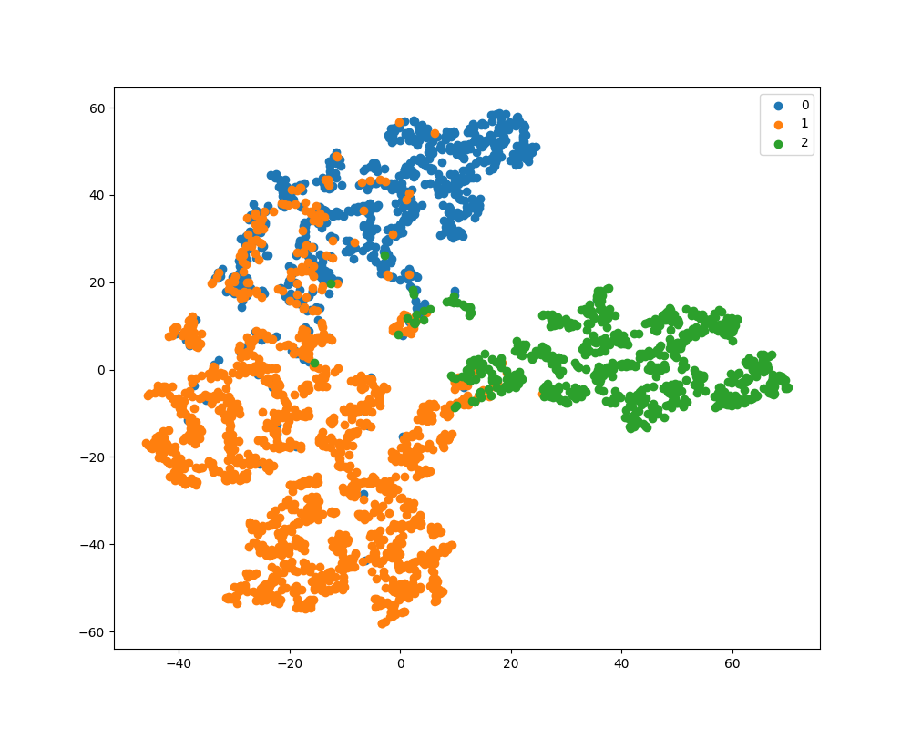

# Sparse Heterogeneous Graph Attention Network (SHAN)

We introduce SHAN, a new model designed to overcome the constraints of current models
in handling heterogeneous graph data using the attention mechanism. By leveraging HAN
for graph sparsification, SHAN performs node classification tasks better. The model
effectively captures diverse and important semantics in heterogeneous graphs. The
importance of graph sparsification for handling noisy data in these graphs is emphasized,
contributing to its overall effectiveness. Experimentally, our architecture gives promising
results by showing improved or almost similar accuracies compared to existing baseline models.
In conclusion, SHAN represents a significant advancement in addressing the challenges posed by heterogeneous graphs.



## Usage

```console
$ python main.py --dataset=ACM
$ python main.py --dataset=IMDB
```

For sampling-based training:
```console
$ python train_sampling.py --dataset=ACM
```

## Performance

| Model | micro f1 score | macro f1 score |
| ----  | -------| ------|
| GCN   | 88.35  | 88.29 |
| GAT   | 87.11  | 87.33 |
| HAN   | 90.51  | 90.63 |
| SHAN  | 93.81  | 93.79 |

